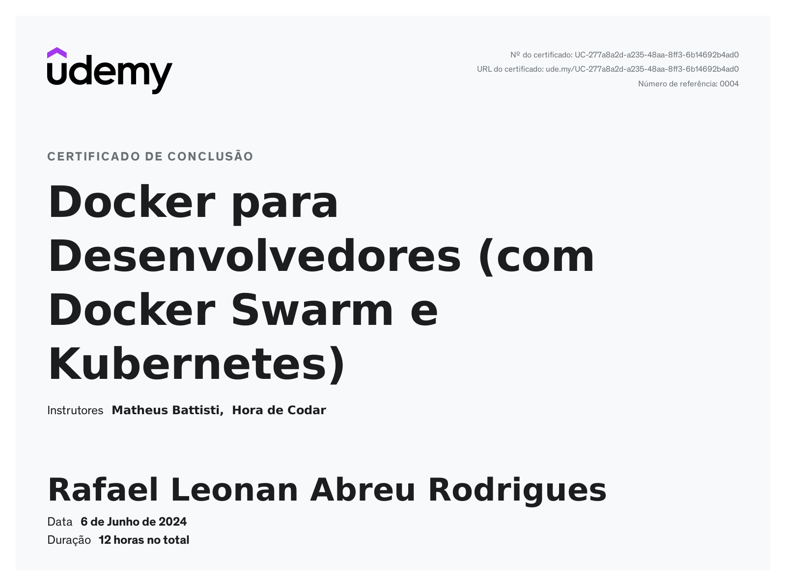

# Docker Swarm e Kubernetes

## Descrição

Curso de Docker do básico ao avançado e ainda orquestração com Docker Swarm e Kubernetes.

## Curso

**Docker para Desenvolvedores (com Docker Swarm e Kubernetes)**

[Link para o curso na Udemy](https://www.udemy.com/course/docker-para-desenvolvedores-com-docker-swarm-e-kubernetes/)

## Projetos desenvolvidos durante o curso:
- /projetos/app_nodejs_docker
- /projetos/app_php_docker
- /projetos/app_py_yaml
- /projetos/docker_compose
- /projetos/docker_compose_networks
- /projetos/docker_compose_networks_container
- /projetos/docker_compose_networks_variaveis
- /projetos/networks_container
- /projetos/networks_externa
- /projetos/networks_host

## Conteúdo do curso

- Docker do básico ao avançado
- Criar e subir containers de Docker
- Criar imagens de Docker
- Docker Compose
- Desenvolvimento de Volumes no Docker
- Criação de networks no Docker
- Bind Mount no Docker
- Docker Swarm
- Kubernetes
- Orquestração de containers
- Kubernetes em modo declarativo e imperativo
- Utilizar o Docker Swarm na AWS
- YAML do básico ao avançado

## Certificado

